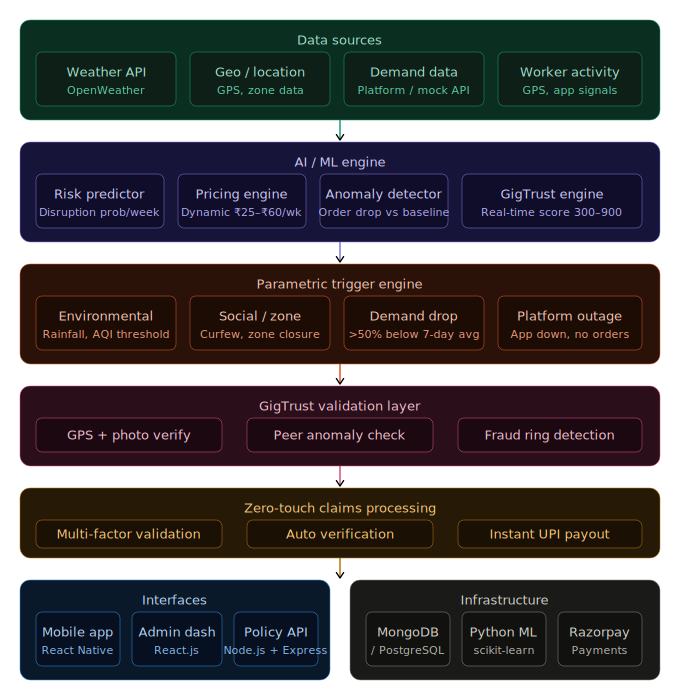

# InstaSure

### AI-Powered, Zero-Touch, Hyper-Local Insurance for Gig Workers

> InstaSure predicts income loss, validates authenticity, and pays gig workers instantly — without requiring claims.

---

## 🧩 Problem Statement

India's gig economy (Swiggy, Zomato, Zepto, Amazon) runs on volatile, unpredictable income. Delivery workers lose **20–30% of their weekly earnings** due to disruptions they have no control over:

- 🌧️ **Environmental** — rain, heat, pollution
- 🚧 **Social** — curfews, strikes, zone closures
- 📉 **Invisible** — demand drops, platform outages

### Why Current Insurance Fails

| Problem | Detail |
|---|---|
| Reactive | Claim-based, not proactive |
| Slow | Payouts take days or weeks |
| Incomplete | Covers only visible events |
| Blind | Cannot detect demand-side income loss |
| Weak | Basic fraud protection only |

### 🔍 Key Insight

> The biggest income losses are **invisible** — caused by demand fluctuations, not just weather or closures. Traditional insurance cannot detect or respond to this.

---

## 💡 Our Solution

**InstaSure** is an AI-powered parametric insurance platform built specifically for gig workers. It:

- 🔮 **Predicts** disruption risk before it happens
- 📊 **Dynamically adjusts** weekly coverage and pricing
- ⚡ **Automatically compensates** workers for income loss
- 🛡️ **Validates authenticity** via the GigTrust Score
- 🤖 Requires **zero manual claims**

---

## 👤 Persona & Scenarios

### Rahul — Food Delivery Partner, Age 26
- Earns ₹600–₹1000/day
- Works 8–10 hours/day
- Depends on lunch and dinner peak hours

---

### 🌧️ Scenario 1: Heavy Rainfall

Sudden rainfall in Rahul's delivery zone causes orders to drop significantly.

**InstaSure detects:** rainfall threshold crossed + reduced worker activity

➡️ **₹300 payout triggered automatically**

---

### 💥 Scenario 2: Demand Drop *(Key Differentiator)*

No rain, no curfew — but orders drop by 60%.

**InstaSure detects:** deviation from 7-day historical average, cross-validated with nearby workers

**InstaSure prompts Rahul to verify:**
- 📍 GPS confirms he is in his active delivery zone
- 📸 Selfie submitted from his pickup location via the app

➡️ **₹200 compensation triggered once verified**

---

### 🚧 Scenario 3: Zone Closure / Curfew

Rahul's area becomes inaccessible.

**InstaSure detects:** geo-restriction + worker inactivity

➡️ **Auto payout triggered**

---

## ⚙️ System Workflow

```
Onboarding → AI Risk Profiling → Weekly Policy Generation
     → Real-Time Monitoring → Parametric Trigger Engine
          → GigTrust Validation → Zero-Touch Payout
```

1. **Onboarding** — worker inputs location, platform, work pattern
2. **AI Risk Profiling** — predicts disruption probability using historical + environmental data
3. **Weekly Policy Generation** — dynamic premium (₹25–₹60) based on risk + GigTrust Score
4. **Real-Time Monitoring** — weather APIs, demand signals, worker activity feeds
5. **Parametric Trigger Engine** — detects disruption events via thresholds + anomaly detection
6. **GigTrust Validation** — validates authenticity before releasing payout
7. **Instant Payout** — simulated UPI transfer, zero manual input required

---

## 💰 Weekly Premium Model

Weekly premiums match gig workers' earning cycles and keep commitment low for higher adoption.

### Dynamic Pricing Inputs
- Area risk score
- Historical disruption frequency
- Worker consistency
- GigTrust Score

| Risk Level | Worker Type | Weekly Premium |
|---|---|---|
| Low | Safe area | ₹25 |
| Medium | Moderate risk | ₹40 |
| High | Flood-prone zone | ₹60 |

**Coverage:** ₹200–₹500 payout per verified event, trigger-based (not claim-based), risk pooled across users.

---

## ⚡ Parametric Trigger System

### Environmental & Social Triggers
- Rainfall or AQI above defined thresholds
- Curfew or zone closure detected

### Advanced Triggers *(Key Differentiators)*

**Demand Drop Detection**
- ≥50% drop vs 7-day rolling average
- Cross-validated with activity from nearby workers

**Platform Outage Detection**
- No order allocation detected
- App inactivity signals

**Multi-Factor Validation**
- External data + worker activity + peer comparison
- Eliminates single-point-of-failure decisions

---

## 🧠 GigTrust Score (GTS)

A real-time reliability score (300–900) assigned to every worker — similar to a credit score, but for gig behavior.

### Score Components
- Work consistency
- GPS integrity
- Behavioral patterns
- Claim history
- Peer comparison

### How It's Used

| Trust Level | Action |
|---|---|
| High (700–900) | Instant payout |
| Medium (500–699) | Partial or delayed payout |
| Low (<500) | Flag + hold for review |

---

## 🤖 AI / ML Integration

| Model | Purpose |
|---|---|
| Risk Prediction | Disruption probability per worker/week |
| Dynamic Pricing Engine | Weekly premium adjustment |
| Demand Anomaly Detection | Identifies abnormal order-volume drops |
| Fraud Detection System | Catches GPS spoofing, fake inactivity |
| GigTrust Engine | Real-time behavioral scoring |

---

## 🚨 Adversarial Defense & Anti-Spoofing

**Core principle: no single signal is ever trusted alone.**

### Fraud Detection Layers

1. **Multi-Signal Validation** — GPS + activity + time patterns, eliminates single-point failure
2. **Behavioral Fingerprinting** — each worker has a baseline; sudden peak-hour inactivity or unrealistic movement triggers a flag
3. **Peer-Based Anomaly Detection** — real disruptions affect all workers in a zone; fraud affects only a synchronized subset
4. **Demand vs Activity Correlation** — a demand drop must be consistent across workers, not isolated to a few
5. **GPS Spoofing Detection** — flags impossible speeds, static coordinates, and location jumps
6. **Claim Pattern Analysis** — repeated payouts and outlier behavior vs peers trigger review

### Fraud Ring Detection

Detects clusters of coordinated actors and flags the entire group rather than individuals.

### Protecting Genuine Workers

- Peer-based validation means no worker is penalized on a single signal
- Confidence-based payouts ensure legitimate claims still go through
- Transparent GigTrust score lets workers understand and improve their standing

---

## 🏗️ Architecture



---

## 🛠️ Tech Stack

| Layer | Technologies |
|---|---|
| Frontend | React Native (worker app), React.js (admin dashboard) |
| Backend | Node.js, Express, REST APIs |
| AI / ML | Python, scikit-learn |
| Database | MongoDB, PostgreSQL |
| Integrations | OpenWeather API, mock demand data, Razorpay (test mode) |

---

## 💰 Business Model

### Revenue Streams
- Weekly subscription: ₹20–₹80 per worker
- Platform partnerships (B2B2C)
- Insurance company collaborations

### Unit Economics
- 1,000 workers × ₹50/week = **₹50,000/week revenue**
- Claims at ~30% = ₹15,000–₹20,000/week
- **Profitable with strong risk modeling and GigTrust fraud control**

---

## 📈 Scalability Roadmap

- Expand to Uber/Ola drivers and freelancers
- IRDAI compliance pathway for real payouts
- Pan-India deployment starting with high-density metros
- Direct platform API integrations (Swiggy, Zomato)
- B2B2C white-labeling for delivery companies

---

## 🏆 What Makes InstaSure Different

| Feature | Traditional Insurance | InstaSure |
|---|---|---|
| Claims | Manual | Zero-touch |
| Pricing | Static | AI-dynamic |
| Coverage | Visible events only | + Demand drop + outages |
| Fraud Detection | Basic | Multi-layer adversarial defense |
| Trust Layer | None | GigTrust Score (300–900) |
| Payout Speed | Days to weeks | Instant (UPI) |

---

## 🏗️ Development Plan

### Phase 1 — Foundation
- Research & system design
- Define triggers & pricing logic
- Basic UI/UX prototypes

### Phase 2 — Core Build
- Worker onboarding flow
- Pricing engine
- Parametric trigger system
- Claims processing

### Phase 3 — Intelligence Layer
- Fraud detection & GigTrust engine
- Instant UPI payouts
- Admin dashboard & analytics

---

> We are not just building an insurance product.
> We are building a **predictive financial safety net for the global gig economy**.
